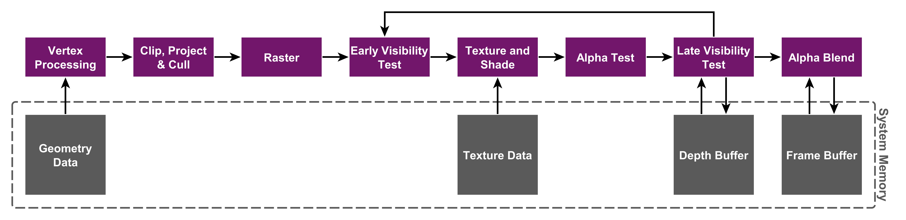

## Imagination PowerVR

### Tile-based deferred rendering
Traditional GPU architecture is immediate mode rendering (IMR).

All PowerVR GPUs are based on unique Tile Based Deferred Rendering (TBDR) architecture. TBDR combines two complementary architectural features to provide the very highest levels of efficiency and performance:
- Tile-based rendering
- Deferred rendering

### Tile-based rendering
The PowerVR architecture splits the screen into a number of ‘tiles’, which are then processed individually (in parallel to other tiles). Since the GPU only needs to work on a subset of the complete scene data at any given time, this data (such as colour and depth buffers) is small enough to be stored in internal GPU memory, significantly reducing the required number of accesses to system level memory. This results in lower energy and bandwidth consumption and also higher performance.

### Deferred rendering
PowerVR deferred rendering uses a unique, patented method of Hidden Surface Removal which defers all texturing and shading operations until the visibility of each pixel in the tile is known – only the pixels that will actually be seen by the end user consume processing resources. This means that unnecessary processing of hidden pixels is eliminated, which further ensures the lowest possible bandwidth usage and number of processing cycles per frame, resulting in the highest performance levels and the lowest power consumption.

### Reference
- [PowerVR graphics architectures](https://www.imaginationtech.com/products/gpu/graphics-architecture/)

## Nvidia Geforce

### Reference
- [Geforce graphics architectures](https://zhuanlan.zhihu.com/p/403345668)
