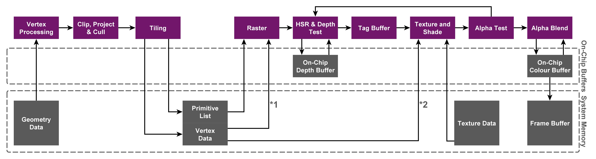

## Immediate mode rendering
Desktop GPUs are based on Immediate mode rendering (IMR) architecture, which process rendering as a strict command stream, executing the vertex and fragment shaders in sequence on each primitive in every draw call:


High-level pseudo-code example of this approach:
```
for draw in renderPass:
    for primitive in draw:
        for vertex in primitive:
            execute_vertex_shader(vertex)
        if primitive not culled:
            for fragment in primitive:
                execute_fragment_shader(fragment)
```

### Advantage
The output of the vertex shader, and other geometry related shaders, can remain on-chip inside the GPU. The output of these shaders can be stored in a FIFO buffer until the next stage in the pipeline is ready to use the data. This means that the GPU uses little external memory bandwidth storing and retrieving intermediate geometry results.

### Disadvantage
The fragment shading jumps around the screen depending on the locations of the triangles in each draw. This happens because any triangle in the stream may cover any part of the screen and triangles are processed in draw order. The effect of this means that the active working set is the size of the entire framebuffer. 

The GPU must fetch from this working set the current value of the data for the pixel coordinate of the current fragment for every blending, depth testing, and stencil testing operation.The bandwidth load placed on this memory can be very high because of multiple read-modify-write operations for each fragment

### Reference
- [Nvidia developer](https://developer.nvidia.com/)
- [Geforce graphics architectures introduction](https://zhuanlan.zhihu.com/p/403345668)
- [AMD developer](https://www.amd.com/en/developer.html)

## Tile-based deferred rendering
Mobile GPUs are based on Tile-based Deferred Rendering (TBDR) architecture, which splits the screen into a number of tiles and fragment shade each small tile to completion before writing it out to memory:



TBDR combines two complementary architectural features to provide the very highest levels of efficiency and performance:
- Tile-based rendering
- Deferred rendering

### Tile-based rendering
The first pass executes all the geometry related processing, and generates a tile list data structure (Visiblity stream from Qualcomm, Per-tile list from Arm, Primitive list from Imagination) that indicates what primitives contribute to each screen tile.

The second pass executes all the fragment processing, tile by tile, and writes tiles back to memory as they have been completed

High-level pseudo-code example of this approach:
```
# Pass one
for draw in renderPass:
    for primitive in draw:
        for vertex in primitive:
            execute_vertex_shader(vertex)
        if primitive not culled:
            append_tile_list(primitive)

# Pass two
for tile in renderPass:
    for primitive in tile:
        for fragment in primitive:
            execute_fragment_shader(fragment)
```

#### Advantage
This approach is designed to minimize the amount of external memory accesses the GPU needs during fragment shading. Since the GPU only needs to work on a subset of the complete scene data at any given time, this data (such as colour and depth buffers) is small enough to be stored in internal GPU memory. GPUs only have to write the color data for a tile back to memory once rendering is complete, significantly reducing the required number of accesses to system level memory. This results in lower energy and bandwidth consumption and also higher performance.

### Deferred rendering
Deferred rendering uses method (Early Z rejection from Qualcomm, Forward pixel killing from Arm, Hidden Surface Removal from Imagination) which defers all texturing and shading operations until the visibility of each pixel in the tile is known – only the pixels that will actually be seen by the end user consume processing resources. 

This means that unnecessary processing of hidden pixels is eliminated, which further ensures the lowest possible bandwidth usage and number of processing cycles per frame, resulting in the highest performance levels and the lowest power consumption.

### Reference
- [Qualcomm developer](https://developer.qualcomm.com/)
- [Snapdragon game toolkit](https://developer.qualcomm.com/sites/default/files/docs/adreno-gpu/snapdragon-game-toolkit/index.html)
- [Arm developer](https://developer.arm.com/)
- [Tile-based rendering](https://developer.arm.com/documentation/102662/0100)
- [Imagination developer](https://developer.imaginationtech.com/)
- [PowerVR graphics architectures](https://www.imaginationtech.com/products/gpu/graphics-architecture/)
- [Parallelizing and optimizing rasterization](https://gfxcourses.stanford.edu/cs248/winter21content/media/gfxhardware/18_mobilegpu_sQg6dwi.pdf)
- [IMR, TBR, TBDR and some understanding of GPU architecture](https://zhuanlan.zhihu.com/p/259760974)
- [Summary of GPU architecture knowledge for mobile devices](https://zhuanlan.zhihu.com/p/259760974)
