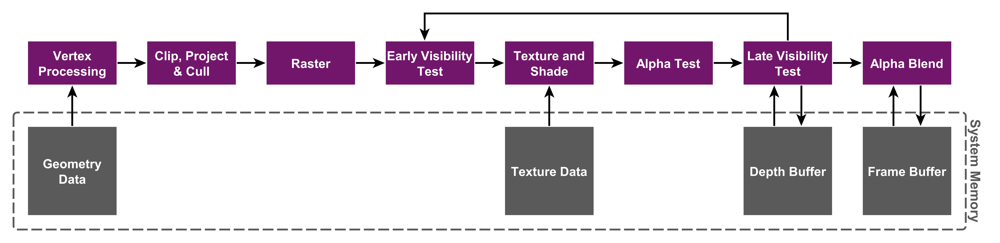
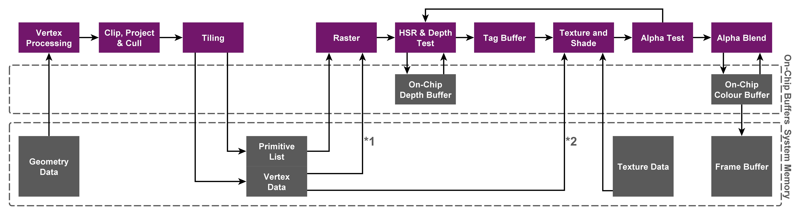

## Architecture taxonomy
GPU architectures can be classified as sort-first, sort-middle (Tile-based rendering), sort-last fragment, and sort-last image:


{}
Sort-middle is also called Tile-based rendering, and sort-last fragment is alse called immediate mode rendering.
{}

## Immediate mode rendering
Desktop GPUs are based on Immediate mode rendering (IMR) architecture, which process rendering as a strict command stream, executing the vertex and fragment shaders in sequence on each primitive in every draw call:



High-level pseudo-code example of this approach:
```
for draw in render pass:
    for primitive in draw:
        for vertex in primitive:
            ExecuteVertexShader(vertex)
        if primitive not culled:
            for fragment in primitive:
                ExecuteFragmentShader(fragment)
```

### Advantage
The output of the vertex shader, and other geometry related shaders, can remain on-chip inside the GPU. The output of these shaders can be stored in a FIFO buffer until the next stage in the pipeline is ready to use the data. This means that the GPU uses little external memory bandwidth storing and retrieving intermediate geometry results.

### Disadvantage
The fragment shading jumps around the screen depending on the locations of the triangles in each draw. This happens because any triangle in the stream may cover any part of the screen and triangles are processed in draw order. The effect of this means that the active working set is the size of the entire framebuffer. The GPU must fetch from this working set the current value of the data for the pixel coordinate of the current fragment for every blending, depth testing, and stencil testing operation.The bandwidth load placed on this memory can be very high because of multiple read-modify-write operations for each fragment. This results in higher power consumption.

### Reference
- [Nvidia developer](https://developer.nvidia.com/)
- [AMD developer](https://www.amd.com/en/developer.html)
- [Geforce graphics architectures introduction](https://zhuanlan.zhihu.com/p/403345668)

## Tile-based deferred rendering
Mobile GPUs are based on Tile-based Deferred Rendering (TBDR) architecture, which splits the screen into a number of tiles and fragment shade each small tile to completion before writing it out to memory:



TBDR combines two complementary architectural features to provide the very highest levels of efficiency and performance:
- Tile-based rendering
- Deferred rendering

### Tile-based rendering
The first pass executes all the geometry related processing, and generates a tile list data structure (Visiblity stream from Qualcomm, Per-tile list from Arm, Primitive list from Imagination) that indicates what primitives contribute to each screen tile. The second pass executes all the fragment processing, tile by tile, and writes tiles back to memory as they have been completed.

High-level pseudo-code example of this approach:
```
# Pass one
for draw in render pass:
    for primitive in draw:
        for vertex in primitive:
            ExecuteVertexShader(vertex)
        if primitive not culled:
            AppendTileList(primitive)

# Pass two
for tile in render pass:
    for primitive in tile:
        for fragment in primitive:
            ExecuteFragmentShader(fragment)
```

### Deferred rendering
Deferred rendering uses method (Early Z rejection from Qualcomm, Forward pixel killing from Arm, Hidden Surface Removal from Imagination) which defers all texturing and shading operations until the visibility of each pixel in the tile is known – only the pixels that will actually be seen by the end user consume processing resources. 

{}
Early Z in IMR is not same as deferred rendering here. Early Z requires that opaque objects be sorted by application, but deferred rendering not.
{}

### Advantage
This approach is designed to minimize the amount of external memory accesses the GPU needs during fragment shading. Since the GPU only needs to work on a subset of the complete scene data at any given time, this data (such as colour and depth buffers) is small enough to be stored in internal GPU memory. GPUs only have to write the color data for a tile back to memory once rendering is complete, significantly reducing the required number of accesses to system level memory. This results in lower bandwidth consumption.

Texture cache performance can be improved textures covering multiple primitives may be accessed more coherently one tile at a time than one primitive at a time.

Much less on-chip space is needed for good performance compared with a general-purpose frame buffer cache. This means that more space can be dedicated to texture cache, further reducing bandwidth.

Unnecessary processing of hidden pixels is eliminated. This results in lower power consumption.

### Disadvantage

Framebuffer reads that might fall outside the current fragment are relatively more costly.

There is a cost to traversing the geometry repeatedly. 

### Reference
- [Qualcomm developer](https://developer.qualcomm.com/)
- [Snapdragon game toolkit](https://developer.qualcomm.com/sites/default/files/docs/adreno-gpu/snapdragon-game-toolkit/index.html)
- [Qualcomm mobile game development guide](https://zhuanlan.zhihu.com/p/1911434325402026577)
- [Arm developer](https://developer.arm.com/)
- [Arm GPU best practices developer guide](https://developer.arm.com/documentation/101897/latest/)
- [Tile-based rendering](https://developer.arm.com/documentation/102662/0100)
- [Imagination developer](https://developer.imaginationtech.com/)
- [PowerVR graphics architectures](https://www.imaginationtech.com/products/gpu/graphics-architecture/)
- [Samsung developer](https://developer.samsung.com/)
- [Galaxy game development](https://developer.samsung.com/galaxy-gamedev)
- [GPU Hardware and Parallel Rasterization](https://gfxcourses.stanford.edu/cs248a/winter24content/media/gpuhardware/18_mobilegpu.pdf)
- [IMR, TBR, TBDR and some understanding of GPU architecture](https://zhuanlan.zhihu.com/p/259760974)
- [Summary of GPU architecture knowledge for mobile devices](https://zhuanlan.zhihu.com/p/259760974)

## Five Common Patterns That Disable Early-ZS and HSR
1. Using discard (or clip) in Shaders
- Impact: Forces Late-ZS Update and typically disables HSR.
- Reason: The GPU cannot determine if a fragment will be written to the depth buffer until the shader finishes execution (since the shader might discard the fragment). To ensure correctness, the GPU must execute the shader first before updating the depth buffer, preventing early optimization.
2. Writing to gl_FragDepth (Modifying Depth)
- Impact: Forces Late-ZS Test & Update and disables HSR.
- Reason: Early-Z relies on the interpolated depth value before the shader runs. If the shader manually modifies the depth value, the early check becomes invalid. The GPU must wait for the shader to calculate the final depth before performing any depth testing.
3. Reading from Depth/Stencil Buffer
- Impact: Forces Late-ZS Update and disables HSR.
- Reason: Reading the depth buffer creates a dependency on previous fragments covering the same pixel. To ensure the read value is correct, the GPU must serialize execution and wait for previous fragments to finish writing to the depth buffer, breaking the parallel pipeline required for early optimizations.
4. Reading from Framebuffer or Pixel Local Storage (PLS)
- Impact: Disables HSR.
- Reason: HSR works by determining the single visible surface before shading. However, if a shader reads the existing color of a pixel (e.g., for programmable blending), it implies a dependency on "what was there before." HSR cannot safely discard covered fragments because their color might be needed by the top-most fragment's shader logic.
5. Writing to SSBOs or UAVs (Side Effects)
- Impact: Defaults to Late-ZS Test & Update (disabling Early-ZS) and disables HSR.
- Reason: By standard, depth testing happens after shading. If a shader writes to a global buffer (SSBO/UAV), that write is a side effect that "should" happen even if the fragment later fails the depth test. Early-Z would prevent the shader from running entirely, missing this side effect.
Solution: You can force Early-Z back on using layout(early_fragment_tests) in; (GLSL) or [earlydepthstencil] (HLSL) if you don't care about the side effects of occluded fragments.

### Reference
- [Five Common Patterns That Disable Early-ZS and HSR](https://nothingtosay0031.github.io/GPU/EarlyZS)
